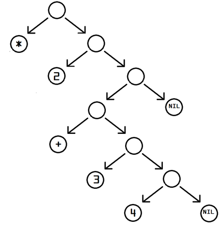

================
Meta Programming
================

.. TODO: check why slime is not loading correctly

.. hi everyone I am Andrea Crotti and I'm going to talk you today about Metaprogramming.
.. you can find me on twitter here and you can also find the source of these slides
.. and all the code I am going to show now there.

.. You are more than welcome to checkout the repository and play around with the examples
.. there since I will do a lot of live coding.
.. Just be aware that all the examples (except macropy) are for Python3, so make sure you have
.. a Python 3 interpreter available.

Twitter: **@andreacrotti**

Slides and code: https://github.com/AndreaCrotti/meta

JOIN US @Depop
==============

.. I work for Depop, an exciting startup in the London silicon
.. roundabout and we are hiring backend Python developers, come and
   talk with me or check out the link there if you are interested.

.. _hiring: http://depop.com/jobs

hiring_

Agenda
======

.. So today we are going to talk about metaprogramming, first by looking at the definition
.. the giving a very quick taste of Lisp and what metaprogramming means in Lisp
.. and then finally switching to Python and showing how to achieve it with Python.

- What is metaprogramming
- Metaprogramming in Lisp

  + homoiconocity
  + macros

- Meta programming in Python

  + decorators
  + meta classes
  + macros

Metaprogramming
===============

.. From wikipedia the definition of metaprogramming is the writing of computer programs that write
.. or manipulate other programs as their data, or that do part of the work at compile time
.. that should otherwise be done at runtime.

.. Lisp macros come in the first category while the standard use of decorators in Python
.. goes into the second category.

.. TODO: sync what said here with the definition below
.. Why on earth would you do that? Usually the answer is not much about performance
.. or better design, but just to have a better way to express domain specific problems
.. minimizing the number of lines of code and making the programs more expressive and flexible.

.. centered::
   Metaprogramming is the writing of computer programs that write or manipulate other programs (or themselves) as their data, or that do part of the work at compile time that would otherwise be done at runtime.

*Goals of metaprogramming*:

- minimize SLOC
- gives programs greater flexibility

.. TODO: add what is the goal of metaprogramming

A Lisp primer
=============

.. In computer terms Lisp is the grandpa of all languages we currently use
.. it was created in the far 1958 by John McCarthy, and it had a massive
.. influence on every other language that came next, there are even new
.. and modern languages like Clojure that took heavily inspiration from it.

.. When people that never used Lisp think about it they think about the massive
.. amount parentheses used, which looks weird and unnecessary in modern languages.
.. However there is a very good reason for that, as I'll try to explain in the
.. next 5 minutes.

.. TODO: should I put homoiconocity only in the next slide?

- invented by McCarthy in 1958
- lots of parentheses
- *homoiconocity*

.. this is the first silly example of a function in Lisp, first we define
.. a factorial function and then we evaluate it.

.. TODO: go in the terminal and show this happening live as well
.. also nothing that the same call to factorial 1000 in Python
.. would easily blow up the stack trace.

.. code:: cl

   (defun factorial(n) 
     (if (<= n 1) 1 (* n (factorial (- n 1)))))

   ;; s-expression to evaluate factorial of 10
   (factorial 10)

.. TODO: for my examples I'm just showing SBCL but any common lisp interpreter
.. will do

Lisp
====

.. In a homoiconic language the primary representation of programs is
   also a data structure in a primitive type of the language itself.

   Lisp in particular uses S-expressions as an external representation
   for data and code.  S-expressions can be read with the primitive
   Lisp function READ, which returns Lisp data: lists, symbols numbers
   and strings.

   (so everything has to be one of these things, and the
   transformation from the source code to the final internal
   representation is as simple as possible)

   Then EVAL computes side effects and return a result, and the result
   is printed by PRINT.

- very minimal syntax
- *homoiconocity*

.. code:: cl

    ((:name "john" :age 20) (:name "mary" :age 18))
    ;; 
    (* (sin 1.1) (cos 2.03))

.. In this case above here '* becomes a symbol, and 'sin as well
.. while the other values are just parsed as numbers as they are

.. When all the functions are infix it is much easier

Lisp Evaluation
===============

.. make a nice graph about the REPL loop
.. The real power of Lisp is that it's possible to simply write S-expressions
.. which are understood without the need of parsing them

..
   - READ
   - EVAL
   - PRINT
   - LOOP

.. TODO: try to make this graph a bit bigger or add a simple example

.. digraph:: repl

   READ -> EVAL -> PRINT;
   PRINT -> READ [label="LOOP"];

.. code:: cl

   (* 2 (+ 3 4))

Metaprogramming in Lisp
=======================

.. So now let's get to the real reason why I talked to you about Lisp
.. which is the way you can do meta programming with it.

.. Thanks to the fact that Lisp is Homoiconic as we have seen before
.. Lisp has probably the most powerful way to do meta programming,
.. which is Lisp macros.
.. In lisp we have a function called setq to assign variables.

.. code:: cl

    (setq x 10)

    ;; I should be able to do
    (setq2 x y 10)

.. while this example is very silly maybe keep in mind that setq is
   the way we assign variables basically, so it would like defining
   another way to do assignment in Python to make a parallel.

.. centered::
   Just write a function right? (not really)

.. code:: cl

   (defun setq2F (x y z)
         (progn (setq x z) (setq y z)))

Macros
======

.. code:: cl

   (defun setq2F (x y z)
         (progn (setq x z) (setq y z)))

.. code:: cl

   (defmacro setq2 (v1 v2 e)
       `(progn (setq ,v1 ,e) (setq ,v2 ,e)))
   
   (setq2 a b (+ 1 z))

.. TODO: show the evaluation of this thing inside the interpreter
   ..
      a
      11
      b
      11

.. centered::
   Can Python do that?

.. the simplest way I found to do this with Python is the following
.. but hopefully everyone will be disgusted about that as I do :D
.. It's not even exactly the same however because I need to pass
.. the variable names and the expression as strings otherwise it won't work.

.. literalinclude:: code/python/meta.py
   :pyobject: setq2

Metaprogramming in Python
=========================

.. TODO: explain what is metaprogramming and what is NOT metaprogramming

.. Is Python homoiconic?

- function decorators
- class decorators
- metaclasses
- why one and why the other? (implicit vs explicit)

.. TODO: add also about descriptors, Dynamic Code generation and AST manipulation
.. TODO: also remember that the more in depth you go (see AST) the more likely
   to have things that only work on a certain implementation

Decorators
==========

.. TODO: explain something about higher level functions and partial application
.. TODO: decorators are in Python just nice syntactic sugar for higher order functions

- function decorators
- class decorators

.. they can be used to modify at compile or run-time the behaviour of a class/function

Timers
======

.. I think there are no doubts that the first implementation is faster than the second
.. implementation, but can I prove it in a repeatable test without modifying the functions?
.. while checking at the same time that both functions return the same value?

.. literalinclude:: code/python/tests.py
    :pyobject: to_time

.. literalinclude:: code/python/tests.py
    :pyobject: to_time2

.. literalinclude:: code/python/tests.py
    :pyobject: TestTime.test_implementation_1_faster

Timers (2)
==========

.. It is particularly important to do this change only at run-time because
.. this decorator actually changes the behavior of the decorated function
.. making it return something different than it originally did.

.. literalinclude:: code/python/timers.py
   :pyobject: timeit_change_signature

Metaclasses
===========

.. TODO: Should I explain the difference between Python2 and Python3? (maybe or maybe not)

.. Before we talk about metaclasses it is worth to mention that while they are very powerful
.. they are also in most of the cases not necessary, and if overused they might cause
.. serious maintainability issues, your present and future colleagues might hate you very hard.

- every class type is *type*

.. code:: python

    class C:
        pass

Equivalent to:

.. code:: python

    C = type('C', (), {})

Create a method as well

.. (Metaclass is the type of the class as a class is the type of an instance).

**Metaclass -> Class**

As

**Class -> Instance**

Metaclass definition
====================

Just subclass *type*.
What are the important methods to use?

.. literalinclude:: code/python/meta.py
    :pyobject: SimpleMeta

.. code:: python

   class UseMeta(object, metaclass=SimpleMeta):
       pass

Defining Models
===============

.. Now we are going to look at an example of something that I think
   everyone used, a model definition.

.. Every web framework allows to define models in a nice and compact way.
.. Let's see how we can define a model without having meta classes.

.. Every web framework or ORM uses similar techniques to define database model
.. straight away from Python.

.. In fact even if Python is dynamically typed a database is not, so if we want
.. to define the database schema in Python we need to give type information

.. literalinclude:: code/python/models.py
   :pyobject: ModelNoMeta

- too verbose!
- too much boilerplate
- no type information
- implicit defaults

Defining Models (2)
===================

.. literalinclude:: code/python/tests.py
   :pyobject: Simple

.. literalinclude:: code/python/tests.py
   :pyobject: TestModels

Fields
======

.. literalinclude:: code/python/models.py
   :pyobject: Field

Models metaclass
================

.. literalinclude:: code/python/models.py
   :pyobject: MetaModel

Enforce good practices
======================

.. Another interesting example of metaclasses is whenever you want to enforce good practices

Debugging and monitoring
========================

Macropy
=======

.. TODO: show some shocking examples about it

From macropy_ website:

MacroPy is an implementation of Syntactic Macros in the Python Programming Language. MacroPy provides a mechanism for user-defined functions (macros) to perform transformations on the abstract syntax tree (AST) of a Python program at import time.

This is an easy way to enhance the semantics of a Python program in ways which are otherwise impossible, for example providing an extremely concise way of declaring classes:

**Not Python3 compatible**

.. and probably very hard to port

Conclusion
==========

- metaprogramming is fun
- the code to implement ORM-style models fits in a slide
- handle **with care**

Questions
=========

.. TODO: thanks and put maybe again the slide about recruiting

Useful resources
================

.. _`what made lisp different`: http://www.paulgraham.com/diff.html
.. _`revenge of the nerds`: http://www.paulgraham.com/icad.html
.. _`homoiconity is not the point`: http://calculist.org/blog/2012/04/17/homoiconicity-isnt-the-point/
.. _`metaprogramming by examples`: http://eli.thegreenplace.net/2011/08/14/python-metaclasses-by-example/
.. _`python decorators and lisp macros`: http://programmers.stackexchange.com/questions/213858/python-decorators-and-lisp-macros
.. _`metaprogramming answer`: http://stackoverflow.com/questions/2565572/metaprogramming-self-explanatory-code-tutorials-articles-books/2566561#2566561
.. _`python-3-patterns-metaprogramming`: http://python-3-patterns-idioms-test.readthedocs.org/en/latest/Metaprogramming.html
.. _macropy: https://github.com/lihaoyi/macropy
.. _sbcl: http://www.sbcl.org/
.. _`roots of lisp`: http://www.paulgraham.com/rootsoflisp.html

- `what made lisp different`_
- `revenge of the nerds`_
- `homoiconity is not the point`_
- `metaprogramming by examples`_
- `python decorators and lisp macros`_
- `metaprogramming answer`_
- `python-3-patterns-metaprogramming`_
- `sbcl_`
- `roots of lisp`_

.. TODO: add a link about the other decorator talks
